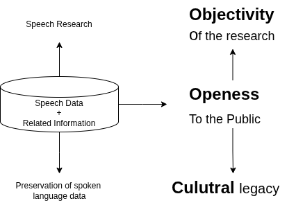

{}

Oriental COCOSDA (O-COCOSDA) originally is the Oriental branch of COCOSDA, which stands for the International Committee for the Coordination and Standardisation of Speech Databases and Assessment Techniques. Established in 1997, its primary goal is to foster idea exchange, share insights, and discuss regional matters related to the creation, use, and distribution of spoken language corpora for Oriental languages. Now O-COCOSDA is independent, with minimal ties to COCOSDA or other regional groups. Additionally, O-COCOSDA focuses on assessing speech recognition and synthesis systems while promoting speech research in Oriental languages.
<!-- 
<!-- {.mt-5} --> 

{}

<!-- The annual Oriental COCOSDA International Conference is the flagship event of O-COCOSDA.
The first preparatory meeting took place in Hong Kong in 1997, and since then, 27 workshops have been hosted in various countries, including Japan, Taiwan, China, Korea, Thailand, Singapore, India, Indonesia, Malaysia, Vietnam, Nepal, Macau, Myanmar, and the Philippines.  -->

<!-- {}

The annual Oriental COCOSDA International Conference is the flagship event of O-COCOSDA.
The first preparatory meeting took place in Hong Kong in 1997, and since then, 27 workshops have been hosted in various countries, including Japan, Taiwan, China, Korea, Thailand, Singapore, India, Indonesia, Malaysia, Vietnam, Nepal, Macau, Myanmar, and the Philippines. 

{}

{}

# This is another section
{.text-center}

{}

{}

# This is another section
{.text-center}

{} -->
# Background
It has been well understood that it is necessary to collect and maintain large amounts of speech data of various kinds, allowing unrestricted access so that they can be utilized for research and development as well as for recognizer performance assessment. Utilization of common speech corpora will increase repeatability and objectivity of speech research. From the linguistic or cultural viewpoint, it is necessary and important to preserve speech data of various languages, especially those that are becoming extinct. It is said that many local languages or dialects are disappearing by the day. Hence there is a pressing need to preserve natural record of such languages. This is another important purpose of speech databases. A collection of data to be used for this purpose is called a speech database or a speech corpus as shown in figure below.

# Governance
<!-- {.text-center} -->

O-COCOSDA is governed by a dedicated committee of experts from across the Oriental region who volunteer their time and expertise to advance speech and language research. The committee is responsible for:

**Convenor**: Setting the overall vision and goals for the organization  
**Steering Committee**: Planning and coordinating the association's activities  
**International Advisory Committee**: Facilitating collaboration between researchers and institutions and promoting international cooperation  
**Country Representatives**: Promoting standardization of speech databases and assessment techniques

# Board of Governors
<!-- {.text-center} -->

**Convenor**: Sakriani Sakti (NAIST, Japan)  
**Steering Committee**: 10  
**International Advisory Committee**:   
**Country Representatives**: 8  

